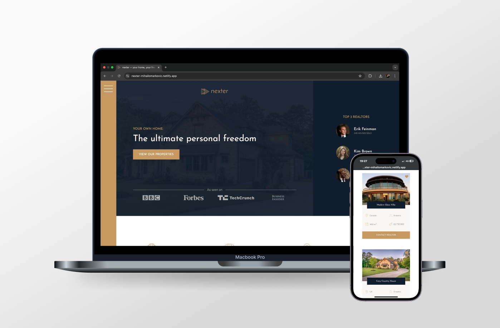

# [Nexter Project 💎](https://nexter-mihailomarkovic.netlify.app/)

## Introduction

Welcome to the Nexter Repository, a project created to master CSS grid layouts and advanced web design techniques. Designed as an example platform for showcasing luxury homes, Nexter demonstrates the flexibility and power of grid-based layouts for creating responsive, visually stunning websites. This project combines clean, semantic HTML with modern CSS and SASS techniques to deliver an engaging and seamless user experience.

This project serves as a milestone in my journey as a developer, showcasing my ability to use CSS grids effectively to create functional and aesthetically pleasing web designs.

## Project Highlights

- **CSS Grid Layouts:** The foundation of this project is built using CSS grid, highlighting its versatility for creating complex, responsive layouts.
- **Responsive Design:** Adapted for optimal usability across desktops, tablets, and smartphones.
- **Modern Aesthetics:** Showcases visually appealing elements that emphasize clarity and professionalism.

## What I Learned

This project allowed me to gain hands-on experience in several key areas:

### HTML

- Structuring content logically for readability and SEO.
- Leveraging semantic elements for accessibility and maintainability.

### CSS & SASS

- Building responsive, grid-based layouts with CSS.
- Organizing styles using SASS for scalability and maintainability.
- Implementing smooth transitions and modern design techniques.

### Design Principles

- Applying contemporary design trends, including balanced typography and harmonious color schemes.
- Crafting user-centric interfaces that prioritize simplicity and engagement.

### Problem-Solving

- Debugging grid alignment and responsiveness issues.
- Iteratively improving layout and functionality based on feedback.

## Project Features

The Nexter website is a visually engaging and interactive project designed to highlight key elements of modern web design:

- **Grid-Based Layouts:** Utilizes CSS grids to structure content efficiently and responsively.
- **Dynamic Elements:** Styled with precision to ensure a polished and professional appearance.

Together, these features demonstrate a thoughtful approach to design and development, blending creativity with technical expertise.

## Technologies Used

- **HTML5:** For clean, semantic markup.
- **CSS3:** For styling and responsive layouts using grids.
- **SASS:** For better code organization and maintainability.

## Closing Thoughts

The Nexter project showcases my growth as a developer, emphasizing mastery of CSS grid layouts and responsive web design. It reflects my commitment to building visually captivating and user-friendly digital experiences.

Thank you for exploring this repository. Please feel free to check out the code and visit the live site. Your feedback is always welcome!
